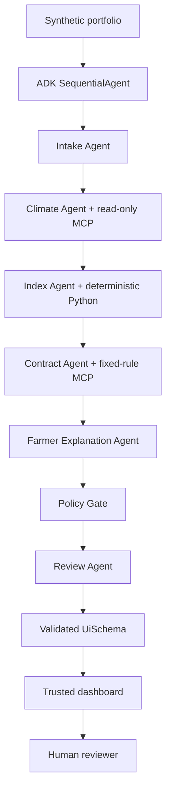

# Architecture

The dashboard calls the deterministic service directly for a reproducible,
API-key-free judging path. The ADK app exposes the same domain workflow for the
optional Gemini playground.

